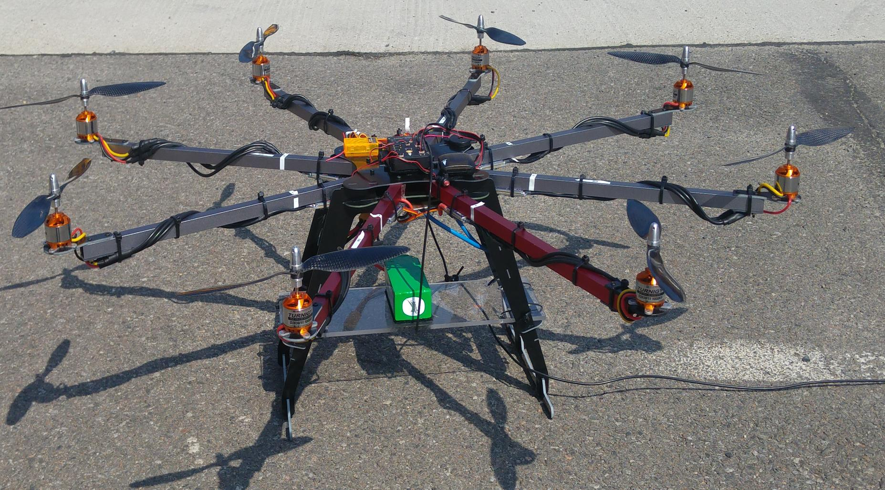

# Robots I Have Worked With

## uBot - 6

This is a dynamically balancing toddler-sized humanoid built at the Labortory of Perceptual Robotics, University of Massachusetts, Amherst. This robot is equipped with ATI Mini45 load cells on both hands. I am using the force-torque data from these sensors, while executing random trajectories to compensate for inaccuracies in the readings of these sensors due to gravitational and inertial loads. This will help to weed out false positives on whether the robot is interacting with an object, and help in building an efficient feedback mechanism for closed loop grasping controllers. Additionally, I am developing bimanual grasping controllers for this robot.

## Siemens Humanoid

This is a 3-wheeled humanoid demo-platform developed at Siemens Corporate Technology, Munich, Germany. As a part of my summer internship at Siemens, in 2018, I developed a follow-me application of this robot, where the robot would use laser-scans of its environment to find the nearest human and follow him around on the pre-defined map of the room using the navigation stack of ROS. Additionally, I used Moveit to build a bimanual clock pick and place application using this robot. 

## Firebird V

I worked on this mobile manipulator built by Nex Robotics as a part of the e-Yantra Robotics Competition, 2015 by IIT Bombay, India. The robot was equipped with multiple Long Range Infrared Sensors and my team built a robotic arm using servo motors to pick up given cargo blocks. The task was to traverse in a predefined grid, looking for cargo blocks and checking for the given correct orientation of those blocks. If the blocks were not sensed in the correct orientation, the robotic arm should pick the block up, turn it around and place it in the correct orientation. Additionally, it should traverse the path from its source to destination in the shortest time. 

# Robots I Have Built

## Octocopter

  
  
  
  

## Surveillance Hovercraft

  
  
  
  
