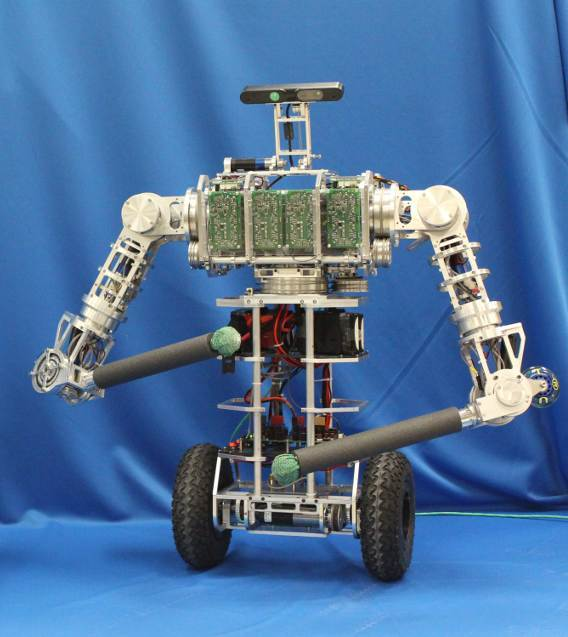
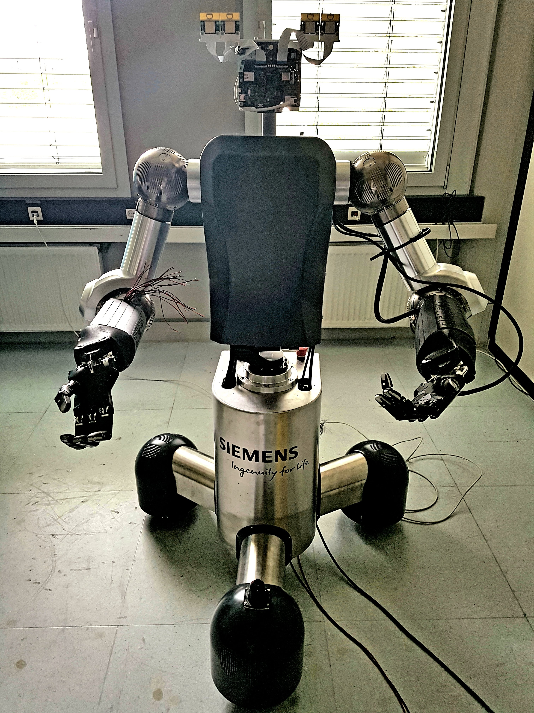
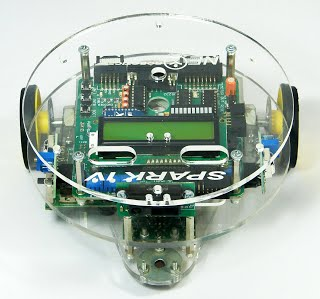
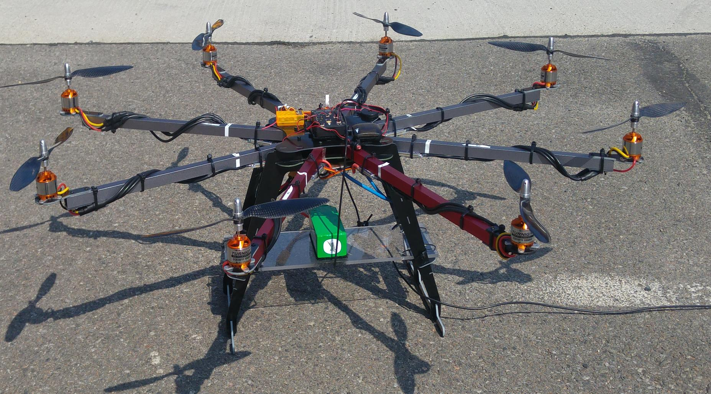
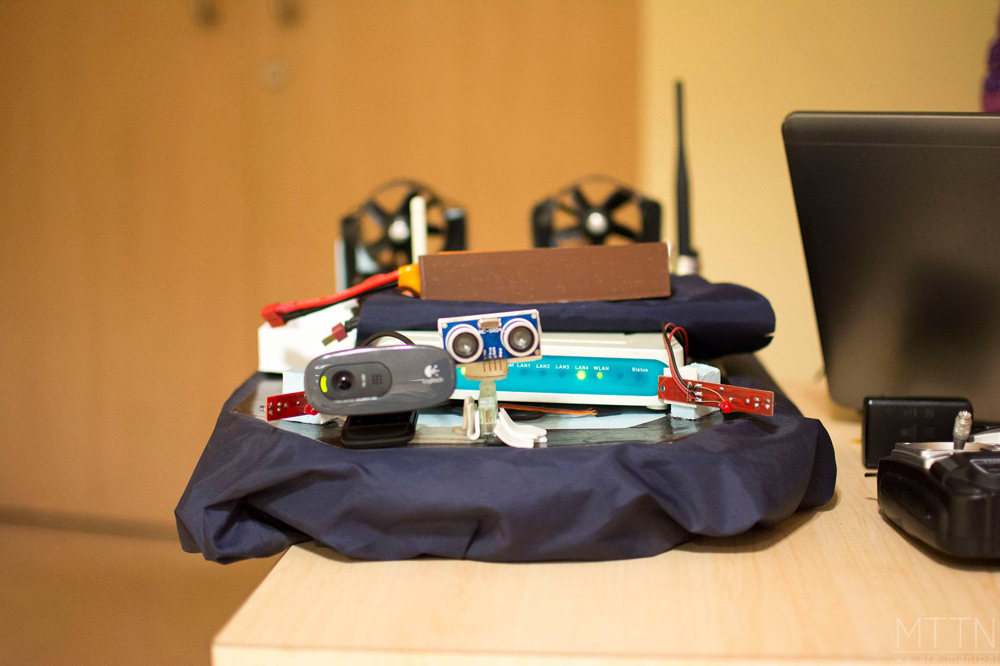

# Robots I Have Worked With

## uBot - 6

This is a dynamically balancing toddler-sized humanoid built at the Labortory of Perceptual Robotics, University of Massachusetts, Amherst. This robot is equipped with ATI Mini45 load cells on both hands. I am using the force-torque data from these sensors, while executing random trajectories to compensate for inaccuracies in the readings of these sensors due to gravitational and inertial loads. This will help to weed out false positives on whether the robot is interacting with an object, and help in building an efficient feedback mechanism for closed loop grasping controllers. Additionally, I am developing bimanual grasping controllers for this robot.

## Siemens Humanoid

  
  
  
  

## Firebird V

  
  
  
  

# Robots I Have Built

## Octocopter

  
  
  
  

## Surveillance Hovercraft

  
  
  
  
